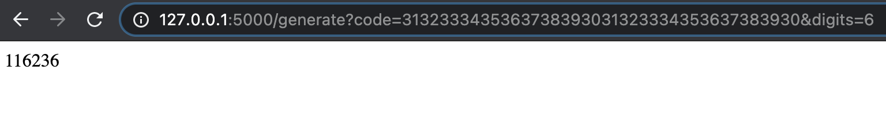

# totp-generator
A free time based OTP generator(client). Based on [RFC-6238](https://tools.ietf.org/html/rfc6238) spec.

## Setup
1. Requires python3.

    `brew install python3`
2. Setup virtual environment

    `python3 -m venv env`

3. Activate virtual environment

    `source env/bin/activate`
4. Run the app locally

    `python app.py`

5. Deploy it in a cloud function or run the flask server locally :)
6. If you want to execute this as a regular python script to try it out

    `python3 local.py <<< base32encodedString`

## Input

Sample input:
`http://127.0.0.1:5000/generate?code=1d319930bdb2ea7d580080f637cd9e53d6ef1767&digits=6`

`code` is the secret key for the SHA-1 hash(hex encoded).
`digits` is number of digits you want the algorithm to return (max 8).
`alg` is the type of SHA algorithm to be used based on the code provided. `SHA-1, SHA-256, SHA-512` supported.

If you're a fan of the curl command:

```
curl -X GET "http://127.0.0.1:5000/generate?code=base32encodedString&digits=6&alg=sha1"
```

To verify that the generator is working as expected
1. Scan the QR code from website https://www.xanxys.net/totp/ on an authenticator app
2. Use the link above in sample and hit the server (running on your machine).
3. Response from the Flask app and your authenticator app should match.

## Output
Here is a sample output:


